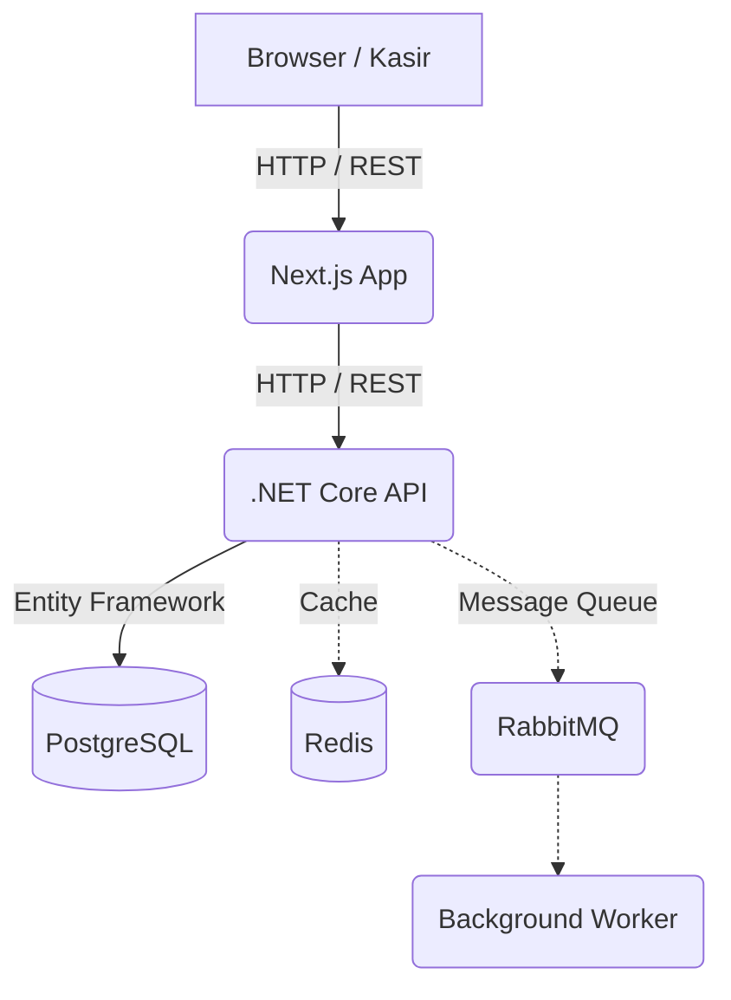

# Tresbros Caffè - Point of Sale (POS) & Backoffice SaaS

Selamat datang di *repository* **Tresbros Caffè**. Aplikasi ini merupakan solusi komprehensif *Point of Sale* (POS), *Kitchen Display System* (KDS), dan Manajemen *Backoffice* (Akuntansi, Inventori, R&D) yang dirancang khusus untuk bisnis Food & Beverage (F&B).

---

## 🏗 Arsitektur Sistem (Architecture)

Aplikasi ini menggunakan arsitektur modern berbasis kontainer (*Containerized Microservices*), yang dirancang untuk performa tinggi dan skalabilitas:

- **Frontend:** [Next.js](https://nextjs.org/) (App Router, React, Tailwind CSS, Zustand)
- **Backend API:** [.NET Core 8](https://dotnet.microsoft.com/) (C#, Entity Framework Core)
- **Database:** [PostgreSQL 15](https://www.postgresql.org/) (Relational Database)
- **Message Broker (TBA):** [RabbitMQ](https://www.rabbitmq.com/) (Untuk antrean *background jobs* dan sinkronisasi data)
- **Caching (TBA):** [Redis](https://redis.io/) (Untuk *caching* respons API dan performa tinggi)
- **Monitoring (TBA):** Prometheus & Grafana



---

## 🛠 Persyaratan Sistem (Prerequisites)

Sebelum menjalankan aplikasi ini, pastikan mesin / *server* Anda sudah ter-install perangkat lunak berikut:

1. **Docker & Docker Compose** (Disarankan menggunakan [Docker Desktop](https://www.docker.com/products/docker-desktop/) untuk Windows/Mac).
2. **Node.js 20+** (Hanya diperlukan jika ingin menjalankan Frontend tanpa Docker).
3. **.NET 8 SDK** (Hanya diperlukan jika ingin menjalankan Backend tanpa Docker).

---

## ⚙️ Variabel Lingkungan (Environment Variables)

Aplikasi membutuhkan konfigurasi *environment variables*. Jika Anda menjalankan via Docker Compose, pengaturan dasar sudah tersedia, namun Anda perlu memperhatikan hal berikut:

### Frontend (`frontend/.env` atau `frontend/.env.local`)
```env
# URL ke Backend API
BACKEND_URL=http://localhost:5052

# Jika menggunakan Docker, biarkan seperti di atas.
```

### Backend (`backend/appsettings.json` / `appsettings.Development.json`)
```json
{
  "ConnectionStrings": {
    "DefaultConnection": "Host=postgres;Database=tresbros;Username=postgres;Password=password"
  },
  "Midtrans": {
    "ServerKey": "SB-Mid-server-xxx",
    "ClientKey": "SB-Mid-client-xxx",
    "IsProduction": false
  },
  "Jwt": {
    "Key": "KunciRahasiaAndaMinimal256BitUntukKeamanan",
    "Issuer": "tresbros-api",
    "Audience": "tresbros-client"
  }
}
```

---

## 🚀 Cara Menjalankan Aplikasi (Deployment)

Cara paling mudah dan direkomendasikan untuk menjalankan seluruh layanan (Frontend, Backend, Database) adalah menggunakan **Docker Compose**.

### 1. Menjalankan Mode Development
Gunakan `docker-compose.yml` standar agar kode Frontend dan Backend dibaca langsung dari folder lokal Anda (mendukung *Hot Reload* / perubahan *real-time*).

Buka terminal di folder root project dan jalankan:
```bash
docker compose up -d --build
```

Layanan yang akan berjalan:
- **Frontend (Web):** http://localhost:3005
- **Backend API:** http://localhost:5052/swagger (Halaman Dokumentasi API Swagger)
- **PostgreSQL:** `localhost:5432`

### 2. Menjalankan Mode Production
Jika ingin men-*deploy* di server asli (production) menggunakan image yang ditarik dari Docker Hub:

```bash
docker compose -f docker-compose.prod.yml up -d --build
```
*(Catatan: Mode ini akan mengunduh versi image produksi yang sudah dikompilasi `syakil/tresbros-frontend:latest` dan tidak akan membaca perubahan kode lokal).*

### 3. Menghentikan Layanan
Untuk mematikan semua layanan Docker:
```bash
docker compose down
# atau jika menggunakan prod:
docker compose -f docker-compose.prod.yml down
```

---

## 💡 Akun Default (Testing)

Saat database pertama kali diinisialisasi, sistem secara otomatis melakukan *seeding* akun **Super Admin**. Anda bisa login di `http://localhost:3005/login` menggunakan:

- **Username:** `admin`
- **Password:** `password`

---

## 🗂 Struktur Direktori Utama
- `/frontend` - Kode sumber aplikasi web Next.js (UI Kasir, KDS, Admin).
- `/backend` - Kode sumber API C# .NET Core.
- `/design_system` - Referensi desain HTML/CSS untuk panduan estetika warna.
- `docker-compose.yml` - Orkestrasi container Docker lokal.
- `*.md` - Dokumen pelacakan tugas (*tasks*) dan spesifikasi fitur (BRD).

---
*Dikembangkan untuk Tresbros Caffè.*
