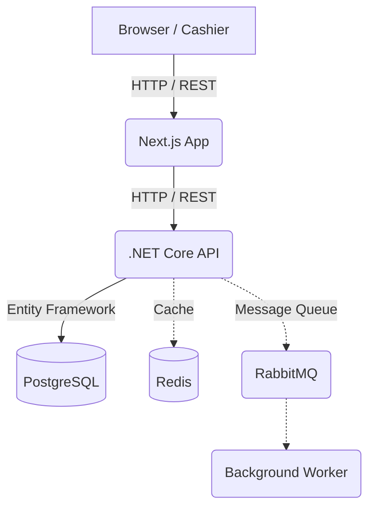

# Tresbros Caffè - Point of Sale (POS) & Backoffice SaaS

Welcome to the **Tresbros Caffè** repository. This application is a comprehensive Point of Sale (POS), Kitchen Display System (KDS), and Backoffice Management (Accounting, Inventory, R&D) solution designed specifically for Food & Beverage (F&B) businesses.

---

## 🏗 System Architecture

This application utilizes a modern containerized microservices architecture, designed for high performance and scalability:

- **Frontend:** [Next.js](https://nextjs.org/) (App Router, React, Tailwind CSS, Zustand)
- **Backend API:** [.NET Core 8](https://dotnet.microsoft.com/) (C#, Entity Framework Core)
- **Database:** [PostgreSQL 15](https://www.postgresql.org/) (Relational Database)
- **Message Broker (TBA):** [RabbitMQ](https://www.rabbitmq.com/) (For background jobs queuing and data synchronization)
- **Caching (TBA):** [Redis](https://redis.io/) (For API response caching and high performance)
- **Monitoring (TBA):** Prometheus & Grafana



---

## 🛠 Prerequisites

Before running this application, make sure your machine/server has the following software installed:

1. **Docker & Docker Compose** (Recommended to use [Docker Desktop](https://www.docker.com/products/docker-desktop/) for Windows/Mac).
2. **Node.js 20+** (Only required if you want to run the Frontend without Docker).
3. **.NET 8 SDK** (Only required if you want to run the Backend without Docker).

---

## ⚙️ Environment Variables

The application requires environment variables configuration. If you run via Docker Compose, basic settings are already provided, but you need to note the following:

### Frontend (`frontend/.env` or `frontend/.env.local`)
```env
# URL to Backend API
BACKEND_URL=http://localhost:5052

# If using Docker, leave it as above.
```

### Backend (`backend/appsettings.json` / `appsettings.Development.json`)
```json
{
  "ConnectionStrings": {
    "DefaultConnection": "Host=postgres;Database=tresbros;Username=postgres;Password=password"
  },
  "Midtrans": {
    "ServerKey": "SB-Mid-server-xxx",
    "ClientKey": "SB-Mid-client-xxx",
    "IsProduction": false
  },
  "Jwt": {
    "Key": "YourSuperSecretKeyMinimum256BitsForSecurity",
    "Issuer": "tresbros-api",
    "Audience": "tresbros-client"
  }
}
```

---

## 🚀 Deployment & Running Locally

The easiest and recommended way to run all services (Frontend, Backend, Database) is using **Docker Compose**.

### 1. Running in Development Mode
Use the standard `docker-compose.yml` so that Frontend and Backend code are read directly from your local folder (supports Hot Reload / real-time changes).

Open a terminal in the project root folder and run:
```bash
docker compose up -d --build
```

Running services:
- **Frontend (Web):** http://localhost:3005
- **Backend API:** http://localhost:5052/swagger (Swagger API Documentation Page)
- **PostgreSQL:** `localhost:5432`

### 2. Running in Production Mode
If you want to deploy on a real server (production) using images pulled from Docker Hub:

```bash
docker compose -f docker-compose.prod.yml up -d --build
```
*(Note: This mode will download the pre-compiled production image `syakil/tresbros-frontend:latest` and will not reflect local code changes).*

### 3. Stopping Services
To shut down all Docker services:
```bash
docker compose down
# or if using prod:
docker compose -f docker-compose.prod.yml down
```

---

## 💡 Default Account (Testing)

When the database is first initialized, the system automatically seeds a **Super Admin** account. You can log in at `http://localhost:3005/login` using:

- **Username:** `admin`
- **Password:** `password`

---

## 🗂 Main Directory Structure
- `/frontend` - Next.js web application source code (Cashier UI, KDS, Admin).
- `/backend` - C# .NET Core API source code.
- `/design_system` - HTML/CSS design reference for aesthetic color guidelines.
- `docker-compose.yml` - Local Docker container orchestration.
- `*.md` - Task tracking documents and feature specifications (BRD).

---
*Developed for Tresbros Caffè.*
