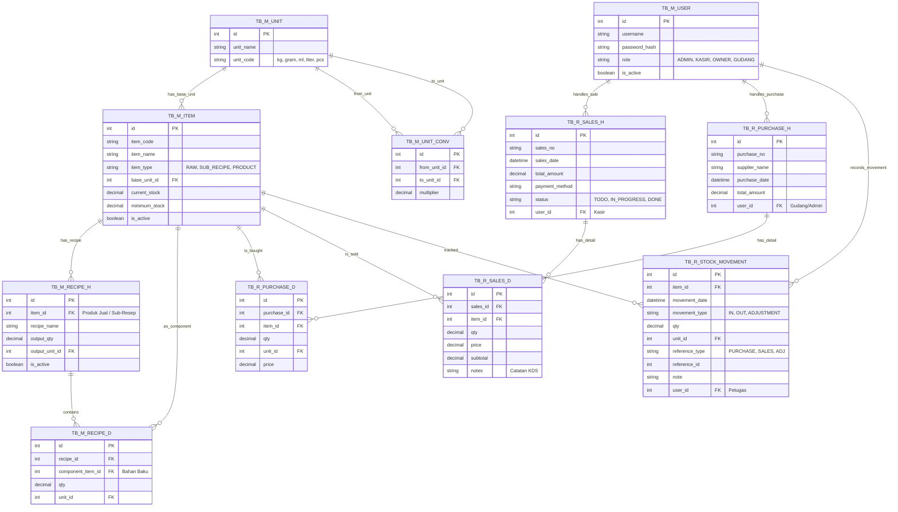

# Entity Relationship Diagram (ERD) Tresbros

Berikut adalah relasi antar tabel (skema database) untuk backend `.NET 8` dan `PostgreSQL`. Format penamaan telah disesuaikan: `TB_M_` untuk tabel Master, dan `TB_R_` untuk tabel Transaksi/Riwayat, beserta struktur Header (`_H`) dan Detail (`_D`).

## Penjelasan Penamaan Tabel (Naming Convention)
- **`TB_M_` (Master)**: Digunakan untuk tabel data *master* yang jarang berubah wujud entitasnya (seperti Item, Satuan, Resep, dan Pengguna).
- **`TB_R_` (Record / Riwayat / Transaksi)**: Digunakan untuk tabel transaksional yang setiap baris datanya merepresentasikan transaksi atau pergerakan yang unik sesuai waktu.
- **`_H` (Header) & `_D` (Detail)**: Transaksi seperti Penjualan (Sales) dan Pembelian (Purchases) dipisah antara informasi payung transaksi (Header: No Struk, Waktu, Total Belanja) dan informasi rincian item (Detail: Qty, Harga Satuan). Format ini sangat lazim dan efisien di sistem ERP & POS.
